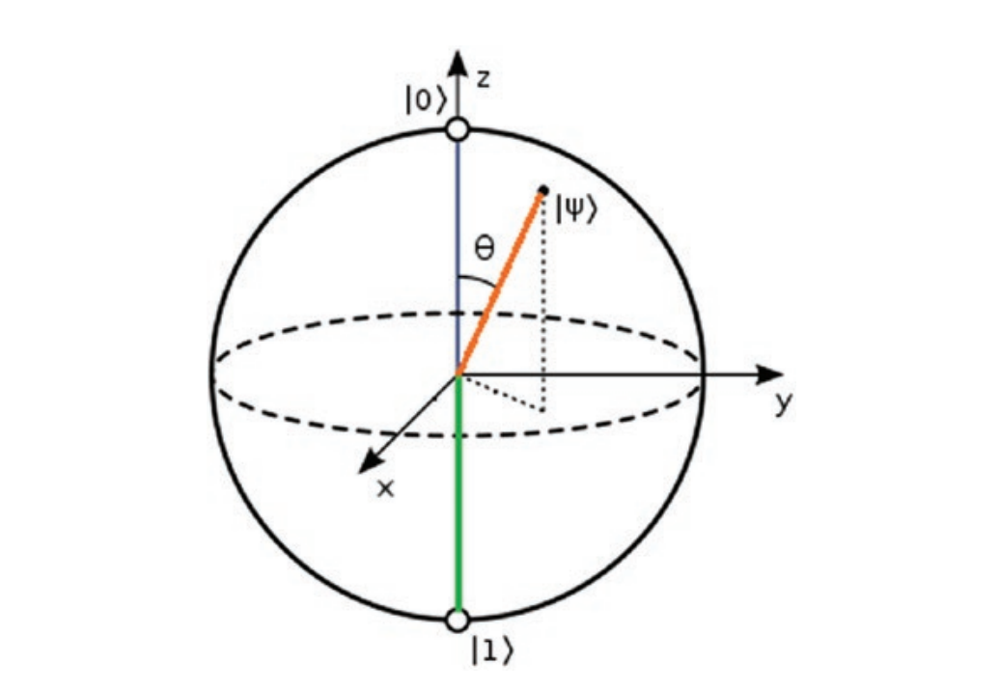

# Quantum Computing

Repository for quantum_computing programming practice and resources.

- This repository will cover quantum programming using mainly python.
- I will upload materials and resources as time goes by

## References

1. J. Izaac and J. Wang, Computational quantum mechanics. Switzerzland: Springer, 2018.

2. D. Senekane, Hand-on quantum information processing with New York: Packt Publishing, 2021.

3. C. Moran, Mastering quantum computing with IBM QX. Birmingham: Packt Publishing, 2019.

4. V. Silva, Practical quantum computing for developers. New York: Apress, 2018.

5. N. Mermin, Quantum computer science. Cambridge: Cambridge University Press, 2016.

6. J. Hidary, Quantum computing. Cham: Springer, 2019.

7. David McMahon., Quantum Computing Explained. Wiley-IEEE Press, 2008.

8. N. Mehta, Quantum Computing. Pragmatic Bookshelf, The, 2020.

9. A. Asfaw, Learn Quantum Computation Using Qiskit, 2020, http://community.qiskit.org/textbook
